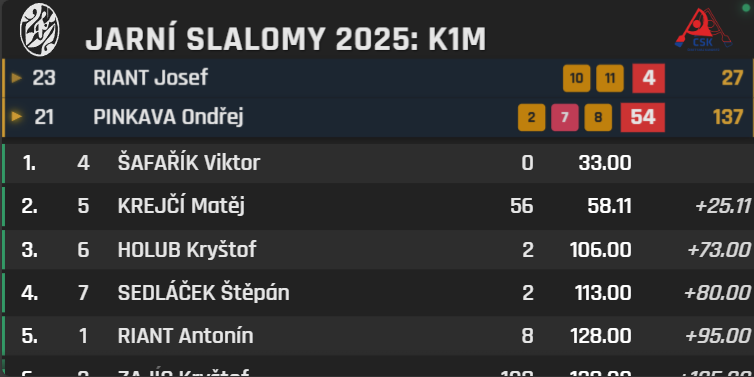
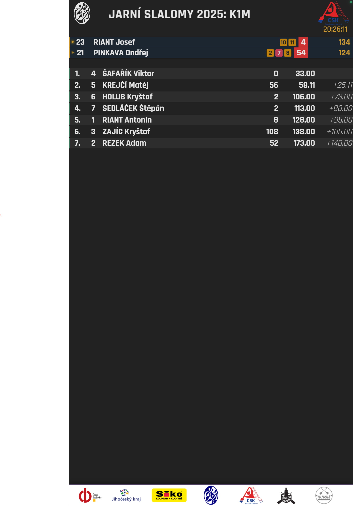

# Canoe Scoreboard

A web application for displaying canoe competition scoreboards, compatible with the existing control application CanoeLiveInterface by Martin „Mako" Šlachta (STiming) . This application is designed to work with different display types, including standard horizontal monitors, vertical displays, and custom LED walls.

<div align="center">
  <a href="preview_lcd.png" target="_blank">
    
  </a>
  <br>
  <a href="preview_vertical.png" target="_blank">
    
  </a>
</div>

This app has been developed in a unique way - I started without any knowledge of React or modern web development, and partnered with AI models (primarily Anthropic Claude Sonnet 3.7) to generate and evolve the code. It has been a great experience to explore this way of pair-programming with AI! 😊

## Table of Contents

- [Features](#features)
- [Installation](#installation)
  - [Prerequisites](#prerequisites)
  - [Setup](#setup)
- [Development](#development)
- [Building for Production](#building-for-production)
- [Usage](#usage)
  - [WebSocket Connection](#websocket-connection)
  - [URL Parameters](#url-parameters)
  - [Configuration Panel](#configuration-panel)
- [Deployment](#deployment)
  - [Web Server](#web-server)
  - [FullpageOS (Raspberry Pi)](#fullpageos-raspberry-pi)
  - [Pi Signage](#pi-signage)
- [Customization and Asset Management](#customization-and-asset-management)
  - [Visual Assets Overview](#visual-assets-overview)
  - [How to Customize Visual Assets](#how-to-customize-visual-assets)
  - [Country Flag Optimization](#country-flag-optimization)
  - [Advanced: Configuration File Customization](#advanced-configuration-file-customization)
  - [Customizing Colors, Fonts and Styling](#customizing-colors-fonts-and-styling)
  - [Image Optimization Tools](#image-optimization-tools)
- [License](#license)
- [Acknowledgments](#acknowledgments)

## Features

- **Real-time updates** via WebSocket connection
- **Multiple display layouts** (horizontal, vertical, LED wall, and custom)
- **Component-based architecture** for easy maintenance
- **Configurable theming** via CSS variables
- **Responsive design** that adapts to different screen sizes

## Installation

### Prerequisites

- [Node.js](https://nodejs.org/) (v16 or newer)
- [npm](https://www.npmjs.com/) (v7 or newer)

### Setup

1. Clone the repository:

   ```bash
   git clone https://github.com/jakubbican/canoe-scoreboard.git
   cd canoe-scoreboard
   ```

2. Install dependencies:

   ```bash
   npm install
   ```

3. Prepare assets (optional):
   ```bash
   node scripts/prepare-assets.js
   ```

### Development

Start the development server:

```bash
npm run dev
```

This will start a development server at http://localhost:3000.

### Building for Production

Build the application for production:

```bash
npm run build
```

This will create a `dist` directory with the production build of the application.

Preview the production build:

```bash
npm run preview
```

## Usage

### WebSocket Connection

The scoreboard connects to the control application CanoeLiveInterface via WebSocket. By default, it connects to `ws://localhost:8081/`, but this can be changed through the configuration panel or URL parameters.

### URL Parameters

You can configure the scoreboard through URL parameters:

- `?type=horizontal` - Set display type (options: `horizontal`, `vertical`, `ledwall`, `custom`)
- `?server=ws://192.168.1.100:8081/` - Set WebSocket server address
- `?width=1280&height=720` - Set custom dimensions when type is `custom`
- `?config=true` - Show configuration panel on load
- `?autoScroll=false` - Disable auto-scrolling of results (default is enabled)
- `?ledwallExactSize=true` - Use exact 768×384 pixel size for LED wall displays (default is false)

Example:

```
http://localhost:3000/?type=vertical&server=ws://192.168.1.100:8081/&autoScroll=false&ledwallExactSize=true
```

### Configuration Panel

Press `Alt+C` to show/hide the configuration panel, which allows you to change settings such as:

- WebSocket server URL
- Display type
- Custom dimensions

## Deployment

### Web Server

Deploy the contents of the `dist` directory to any web server.

### FullpageOS (Raspberry Pi)

[FullpageOS](https://github.com/guysoft/FullPageOS) is a great and lightweight way to serve Scoreboard to any display through RaspberryPI. Tested with Raspberry Pi 3 A+ and Raspberry Pi 5 (2GB RAM).

1. Build the application and serve `dist` from web server as usual.

2. Deploy [FullpageOS](https://github.com/guysoft/FullPageOS) on your Raspberry PI using RPI Imager or other tool of your choice.

3. Connect to RPI console through SSH to configure it:

   ```bash
   ssh pi@[raspberry-pi-ip]
   ```

4. On RPI, set FullpageOS to render served scoreboard:

   ```bash
   sudo nano /boot/firmware/fullpageos.txt
   ```

   In editor, replace the sample URL address with your served page. Include all URL parameters:

   ```
   http://[your-server-address]:[port]/[some-path]/?type=vertical&server=ws://[CanoeLiveInterface-ip]:8081/
   ```

5. (Optional) Adjust the screen orientation for vertical displays:
   ```bash
   sudo nano /home/timing/scripts/start_gui
   ```
   Edit value of `DISPLAY_ORIENTATION`, e.g.:
   ```
   DISPLAY_ORIENTATION=left
   ```
6. On low-memory RPIs, skip the chromium browser memory check:

   ```bash
   sudo nano /home/timing/scripts/start_chromium_browser
   ```

   Add `--no-memcheck` among the flags.

7. Reboot your RPI:

   ```bash
   sudo reboot
   ```

8. You shall see Scoreboard displayed to RPI's HDMI output.

Some of those files (namely `/boot/firmware/fullpageos.txt`) can be edited on a SD card in your computer. It is also possible to change splash screen of FullPageOS by adding your splash png to SD card and addressing it in `~/scripts/run_onempageos` file by editing line `feh --bg-center /boot/firmware/your-splash.png`.

### Pi Signage

1. Build the application:

   ```bash
   npm run build
   ```

2. Create a zip file of the `dist` directory:

   ```bash
   cd dist
   zip -r ../canoe-scoreboard.zip *
   ```

3. Upload the `canoe-scoreboard.zip` file to your Pi Signage server.

4. Configure Pi Signage to display the scoreboard as a web asset.

## Customization and Asset Management

The scoreboard application offers extensive customization options that allow you to personalize the appearance and branding without code changes. These customizations fall into two main categories:

1. **Visual Assets** - Images, logos, and flags that give the scoreboard its branded appearance
2. **Style Customizations** - Color schemes, fonts, and sizing adjustments through CSS variables

### Visual Assets Overview

The application uses a combination of:

- **Core UI Assets** - Logo, partner logos, footer images, and competition elements
- **Country Flags** - Used to display competitor nationalities
- **Event-specific Graphics** - Can be customized for different competitions

### How to Customize Visual Assets

#### 1. Preparing Your Custom Images

The application automatically adapts asset display based on the selected layout. For optimal results, prepare your image files according to these layout-specific recommendations:

##### Logo and Partner Images

| Asset         | File Location                | Layout Type         | Recommended Size | Format | Notes                                       |
| ------------- | ---------------------------- | ------------------- | ---------------- | ------ | ------------------------------------------- |
| Main Logo     | `public/assets/logo.png`     | Horizontal/Vertical | 250px × 70px     | PNG    | Height scales to top bar (approx. 80-90px)  |
|               |                              | LED Wall            | 120px × 55px     | PNG    | Fixed max dimensions in LED wall layout     |
| Partners Logo | `public/assets/partners.png` | Horizontal/Vertical | 300px × 60px     | PNG    | Width capped at 300px, height scales to fit |
|               |                              | LED Wall            | 120px × 45px     | PNG    | Smaller size for LED wall layout            |

##### Footer and UI Elements

| Asset          | File Location              | Layout Type         | Recommended Size | Format | Notes                                       |
| -------------- | -------------------------- | ------------------- | ---------------- | ------ | ------------------------------------------- |
| Footer Banner  | `public/assets/footer.png` | Horizontal/Vertical | 1920px × 120px   | PNG    | Fixed height of 120px across layouts        |
|                |                            | LED Wall            | Not displayed    | N/A    | Footer is hidden in LED wall layout         |
| Bib Background | `public/assets/bib.png`    | Horizontal          | 100px × 100px    | PNG    | Matches 100px bib column in horizontal mode |
|                |                            | Vertical/LED Wall   | 80px × 80px      | PNG    | Matches 80px bib column in these layouts    |

**Format and Design Recommendations:**

- Use PNG format for logos and graphics that need transparency
- For best results on high-resolution displays, consider providing images at 2x the recommended dimensions
- The application will automatically resize images to fit their containers while maintaining aspect ratio
- BMP format for flags ensures compatibility with the control system
- SVG files can be used directly and their colors adjusted using the included script:
  ```bash
  node scripts/svg-color-adjuster.cjs input.svg [output.svg] "#8A2BE2"
  ```
- SVG files can be referenced directly in the config.json file (see Advanced Configuration below)

#### 2. Installing Custom Assets

You have three methods to install your custom assets:

**Method A: Direct Replacement (Simplest)**

1. Navigate to the `public/assets/` directory
2. Replace the existing files with your custom files using the same filenames
3. For country flags, place BMP files in `public/assets/flags/` directory with the correct three-letter country code (e.g., `USA.bmp`, `CZE.bmp`)

**Method B: Using the Asset Preparation Script**

1. Place your custom files in the `assets-source/` directory
2. Run the asset preparation script:
   ```bash
   node scripts/prepare-assets.js
   ```
3. The script will:
   - Copy your assets to the correct locations
   - Create any missing directories
   - Set up placeholder assets for any missing files

**Method C: Post-Deployment Customization**

1. After deploying the application, replace image files directly in the deployed `assets/` directory
2. Edit the `assets/config.json` file to specify new file paths if filenames differ from defaults
3. Increment the `cacheVersion` value in the config file to force browsers to reload cached assets

### Country Flag Optimization

The application uses base64-encoded flag images embedded directly in the JavaScript code for optimal performance, rather than loading individual image files:

1. **Adding New Flags**: Place BMP flag files in the `assets-source/flags/` directory using 3-letter country codes (e.g., `CZE.bmp`)

2. **Converting to Base64**: Run the flag conversion script:

   ```bash
   # Convert flags to base64 encoding
   node scripts/flags-to-base64.cjs

   # Rebuild the application
   npm run build
   ```

**Important Notes:**

- Base64 encoding eliminates HTTP requests for flags and improves loading performance
- For deployments where flags are not needed, the default empty `flagsBase64.js` file keeps bundle size small
- A backup of previously encoded flags is maintained in `flags-base64-backup.js`
- To restore flags from backup, copy the content from `flags-base64-backup.js` to `src/utils/flagsBase64.js`

**Flag Image Requirements:**

- Format: BMP (preferred for compatibility with the control system)
- Filename: Three-letter country code (ISO 3166-1 alpha-3), e.g., `CZE.bmp`
- Recommended size: 60px × 40px

#### 4. Advanced: Configuration File Customization

The application uses a JSON configuration file (`public/assets/config.json`) that can be edited to customize asset paths:

```json
{
  "assets": {
    "logo": {
      "path": "logo.svg",
      "type": "image/svg+xml",
      "description": "Main logo displayed in the top bar - SVG sample"
    },
    "partners": {
      "path": "partners.png",
      "type": "image/png",
      "description": "Partners/sponsors logos displayed in the top bar"
    },
    "footer": {
      "path": "footer.png",
      "type": "image/png",
      "description": "Footer image with sponsor logos"
    },
    "bib": {
      "path": "bib.png",
      "type": "image/png",
      "description": "Bib number background image"
    }
  },
  "settings": {
    "cacheVersion": 1,
    "preloadAssets": true
  }
}
```

This configuration allows you to:

- Change asset filenames or paths
- Use different image formats by updating both path and type
- Force cache refresh by incrementing cacheVersion
- Control preloading behavior

### Customizing Colors, Fonts and Styling

The application uses CSS variables for easy styling customization. To change the visual theme:

1. Edit the CSS variables in `src/styles/main.css`:

   ```css
   :root {
     --primary-color: #003366; /* Dark blue */
     --primary-light: #0046b8; /* Lighter blue */
     --secondary-color: #ffffff; /* White */
     --accent-color: #ffff00; /* Yellow */
     --highlight-color: #ffc0cb; /* Pink */
     --error-color: #e32213; /* Red */
     /* ... other variables ... */
   }
   ```

2. Rebuild the application after making changes:

   ```bash
   npm run build
   ```

3. Key styling variables include:
   - Color scheme variables (primary, secondary, accent colors)
   - Font family and size variables
   - Spacing and layout variables
   - Component-specific styling variables

### Image Optimization Tools

For the best performance, especially on lower-powered devices like Raspberry Pi, you can optimize your images:

```bash
node scripts/optimizeImages.js
```

This script:

- Automatically resizes oversized images to recommended dimensions
- Compresses images while maintaining quality
- Preserves aspect ratios during resizing
- Optimizes PNG compression settings

## License

This project is licensed under the ?????.

## Acknowledgments

- Standa Ježek from Czech Canoe Union
- Original CanoeLiveInterface scoreboard system by Martin „Mako" Šlachta (STiming)
- React framework and community
- Vite.js build tool
- ...and especially my AI buddy Claude Sonnet 3.7
